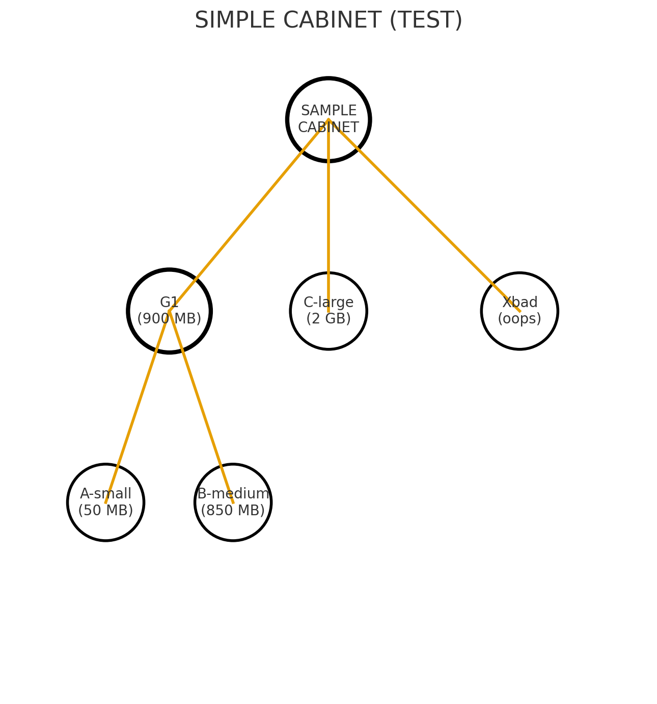
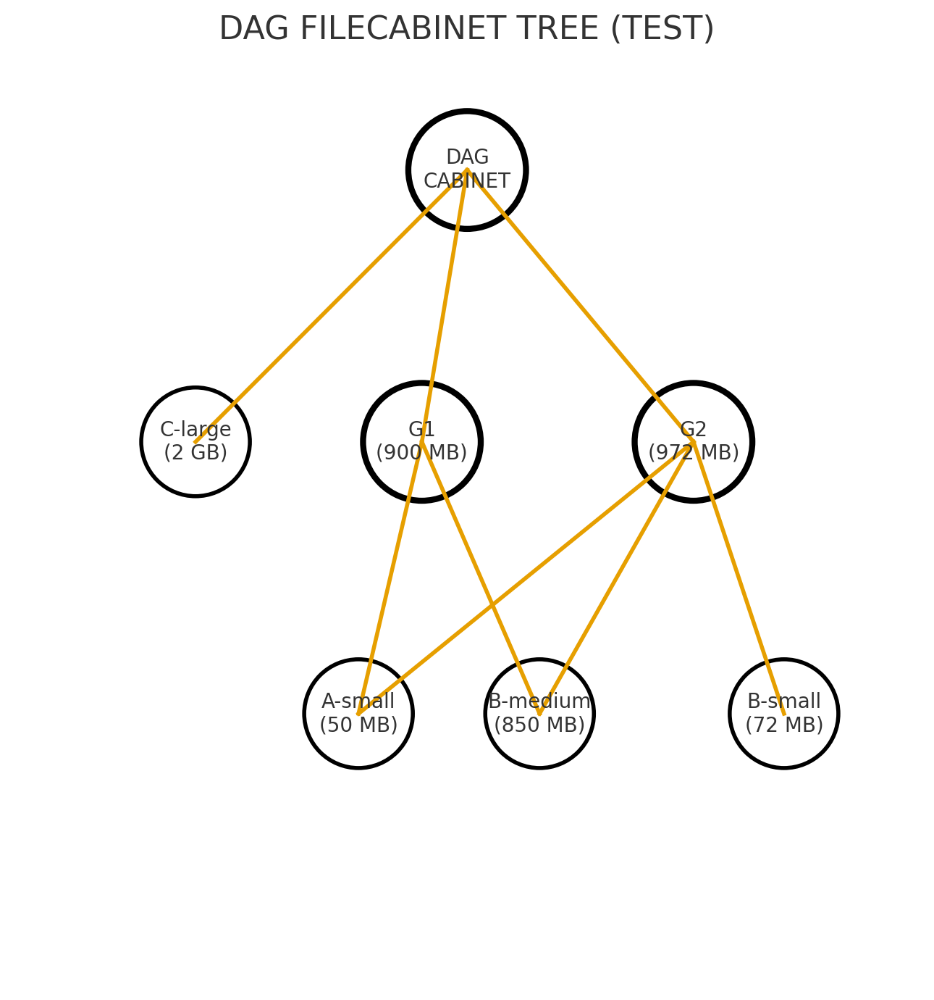
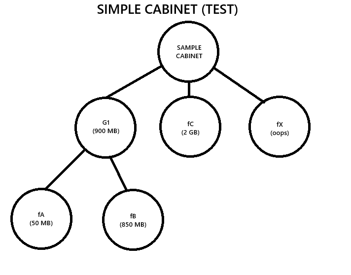
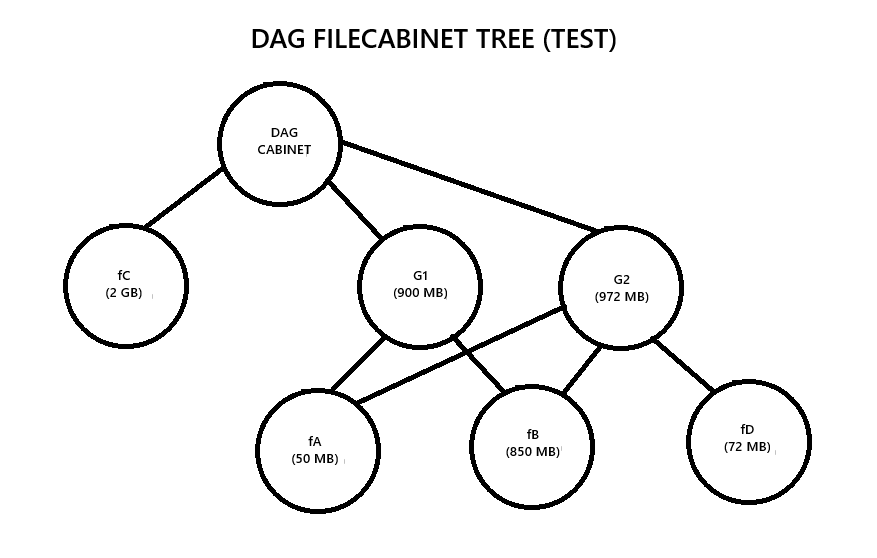

# FileCabinet (Java 17)

Implementation of `Cabinet` / `Folder` / `MultiFolder` with BFS traversal (handles nested `MultiFolder`)
and reference-based de-duplication (DAG-safe). Size filtering supports `SMALL` / `MEDIUM` / `LARGE`.

---

## Features
- `findFolderByName(String)` — returns the first matching folder (BFS, early exit).
- `findFoldersBySize(String)` — returns all folders that fall into a size bucket (`SMALL`/`MEDIUM`/`LARGE`).
- `count()` — counts **unique** nodes (reference de-duplication; safe on DAGs).
- Thresholds: `< 100MB` → SMALL, `100MB–<1GB` → MEDIUM, `≥ 1GB` → LARGE.
- Accepted size formats (no spaces): `123`, `123KB`, `10MB`, `2GB`. Unparseable values are ignored.

## API (overview)
- `Cabinet` — entry point with `findFolderByName`, `findFoldersBySize`, `count`.
- `Folder` — minimal contract: `name()` and `size()` (as strings).
- `MultiFolder extends Folder` — composite folder: `getFolders()` returns children.

## Design notes
- **Traversal**: iterative **BFS** with a queue.
- **DAG safety**: a `visited` set backed by `IdentityHashMap` de-duplicates by **reference**.
- **Parsing**: sizes are parsed from strings; invalid values are skipped, not failing the search.

## Requirements
- Java 17+
- Maven 3.9+

## Build & test
```bash
mvn -DskipTests=false test
```

The diagrams below illustrate the sample structures used in tests.

| Simple cabinet | DAG cabinet |
| --- | --- |
|  |  |

Raw node-only versions:
- 
- 
